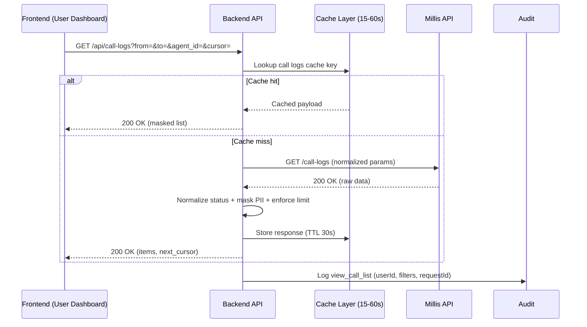
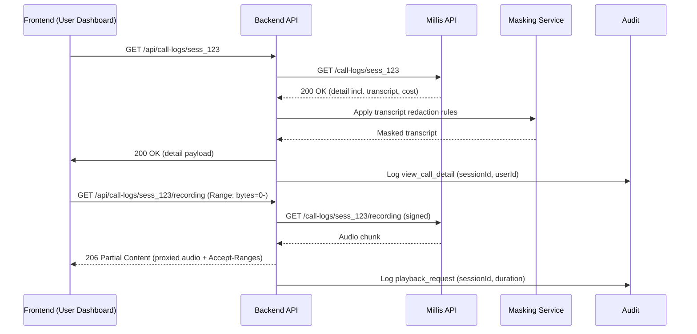

# User Dashboard Sequence Diagrams

## Calls List (`GET /api/call-logs`)

```mermaid
sequenceDiagram
    participant FE as Frontend (User Dashboard)
    participant BE as Backend API
    participant Cache as Cache Layer (15-60s)
    participant Millis as Millis API

    FE->>BE: GET /api/call-logs?from=&to=&agent_id=&cursor=
    BE->>Cache: Lookup call logs cache key
    alt Cache hit
        Cache-->>BE: Cached payload
        BE-->>FE: 200 OK (masked list)
    else Cache miss
        BE->>Millis: GET /call-logs (normalized params)
        Millis-->>BE: 200 OK (raw data)
        BE->>BE: Normalize status + mask PII + enforce limit
        BE->>Cache: Store response (TTL 30s)
        BE-->>FE: 200 OK (items, next_cursor)
    end
    BE->>Audit: Log view_call_list (userId, filters, requestId)
```

## Call Detail (`GET /api/call-logs/{sessionId}`)

```mermaid
sequenceDiagram
    participant FE as Frontend (User Dashboard)
    participant BE as Backend API
    participant Millis as Millis API
    participant Mask as Masking Service

    FE->>BE: GET /api/call-logs/sess_123
    BE->>Millis: GET /call-logs/sess_123
    Millis-->>BE: 200 OK (detail incl. transcript, cost)
    BE->>Mask: Apply transcript redaction rules
    Mask-->>BE: Masked transcript
    BE->>FE: 200 OK (detail payload)
    BE->>Audit: Log view_call_detail (sessionId, userId)

    FE->>BE: GET /api/call-logs/sess_123/recording (Range: bytes=0-)
    BE->>Millis: GET /call-logs/sess_123/recording (signed)
    Millis-->>BE: Audio chunk
    BE-->>FE: 206 Partial Content (proxied audio + Accept-Ranges)
    BE->>Audit: Log playback_request (sessionId, duration)
```
